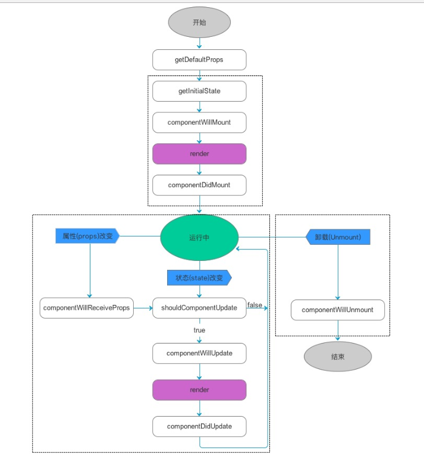

# 前端框架
## React
- 生命周期

- jsx javascipt的语法扩展,一种标记语言，在React编译JSX将它处理为一个javascript对象
    - 可以在JS中书写XML(HTML)
    - 每个解构中只能有且仅有一个顶层元素
    - 可以包含子节点
    - 支持插值表达式
- props和state
    - react的数据流动是自定向下由父级到子级的单向数据流
    - props是组件从父级传入子级的数据，不可被修改
    - state是组件自身内部的状态，可以使用setState修改，主要用来组件控制和修改自己的状态，没有state的叫做无状态组件
- 组件 React的思想主要是关于组件，各个功能可以划分为各个小组件，组件可以灵活复用组合组成更大的组件
    - 创建组件
        - 使用无状态函数
        ```javascript
            function Component() {
                return <h1>Hello World</h1>
            }
        ```
        - ES6类语法 
        ```javascript
            class Component extends React.Component{
                render(){
                    return <h1>Hello World</h1>
                }
            }
        ```
        - ES5类语法 
        ```javascript
            const Component = React.createClass({
            render(){
                return <h1>Hello World</h1>
            }
        })
        ```
- 组件API
    - setState 使用setState修改state值，setState会异步的合并所有的修改然后触发render
    - replaceState 替换状态 
    - findDOMNode获取dom节点
    - isMounted判断组件挂载状态
- 虚拟(virtual)DOM和DOM Diff
## Vue
### 生命周期

### 组件
    - 基础组件
    ```javascript
        <div id="app">
            <button-counter></button-counter>
        </div>

        Vue.component('button-counter',{
            data:function(){
                return {
                    count: 0
                }
            },
            template:'<button @click="count++">you clicked me {{count}} times</button>'
        })

        new Vue({
            el:'#app'
        })
    ```
    -  上面demo是Vue.component全局注册的方式
    - 一个组件的 data 选项必须是一个函数，因此每个实例可以维护一份被返回对象的独立的拷贝，不然组件复用会因为不独立的数据导致相互关联触发
- 组件通信
    - 父到子 利用props
    ```javascript
        <div id="app">
            <button-counter name='shmilyvidian'></button-counter>
        </div>
        Vue.component('button-counter',{
			props:['name'],
            data:function(){
                return {
                    count: 0
                }
            },
            template:'<button @click="count++">{{name}} clicked me {{count}} times</button>'
        })

        new Vue({
            el: "#app",
        })
    ```
    - 子到父 通过事件向父组件发送消息
     $emit 方法并传入事件的名字，来向父级组件触发一个事件
    ```javascript
        <div id="blog-posts-events-demo">
            <div :style="{ fontSize: postFontSize + 'em' }">
                <blog-post
                    v-for="post in posts"
                    v-bind:key="post.id"
                    v-bind:post="post"
                    v-on:enlarge-text="postFontSize += 0.1"      
                ></blog-post>
            </div>
        </div>

        Vue.component('blog-post', {
            props: ['post'],
            template: `
                <div class="blog-post">
                <h3>{{ post.title }}</h3>
                <button @click="$emit('enlarge-text')">
                    Enlarge text
                </button>
                <div v-html="post.content"></div>
                </div>
            `
            })

        new Vue({
            el: '#blog-posts-events-demo',
            data: {
                posts: [
                    { id: 1, title: 'My journey with Vue' },
                    { id: 2, title: 'Blogging with Vue' },
                    { id: 3, title: 'Why Vue is so fun' }
                ],
                postFontSize: 1
            }
        })
    ```
### vue-router
- 安装 npm i vue-router --save
## Angular